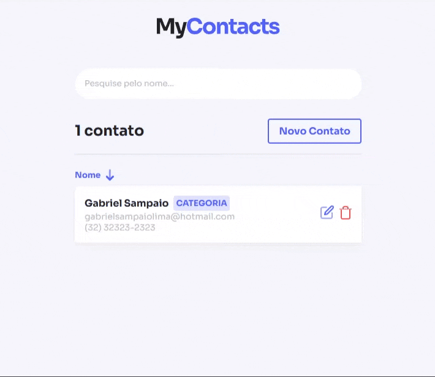

# 📞 App My Contacts

**App My Contacts** is a lightweight and efficient contact management application built with modern web technologies. It allows users to seamlessly create, read, update, and delete contact entries.

## 🚀 Tech Stack

- **React** – Library for building user interfaces
- **Vite** – Fast build tool for optimized development
- **JavaScript** – Core programming language for front-end logic
- **Styled Components** – Component-level styling using tagged template literals
- **CSS** – Styling for UI elements

## 📌 Key Features

- ✅ Create contacts with name, email, and phone number
- ✅ View a list of all contacts
- ✅ Search contacts by ID
- ✅ Update contact information
- ✅ Delete existing contacts

<div align="center">

</div>

## 🔧 Getting Started

To run the application locally, follow these steps:

1. Clone the repository:
   ```bash
   git clone https://github.com/sampaiogabriel/app-my-contacts.git
   cd app-my-contacts
   ```

2. Install dependencies:
   ```bash
   npm install
   ```

3. Start the development server:
   ```bash
   npm run dev
   ```

4. Open your browser and go to:
   ```
   http://localhost:3000
   ```

## 📝 License

This project is licensed under the **MIT License**.
